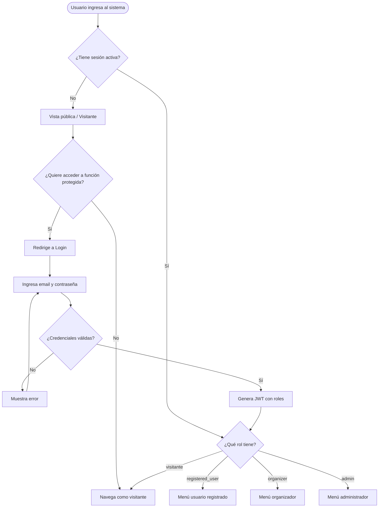
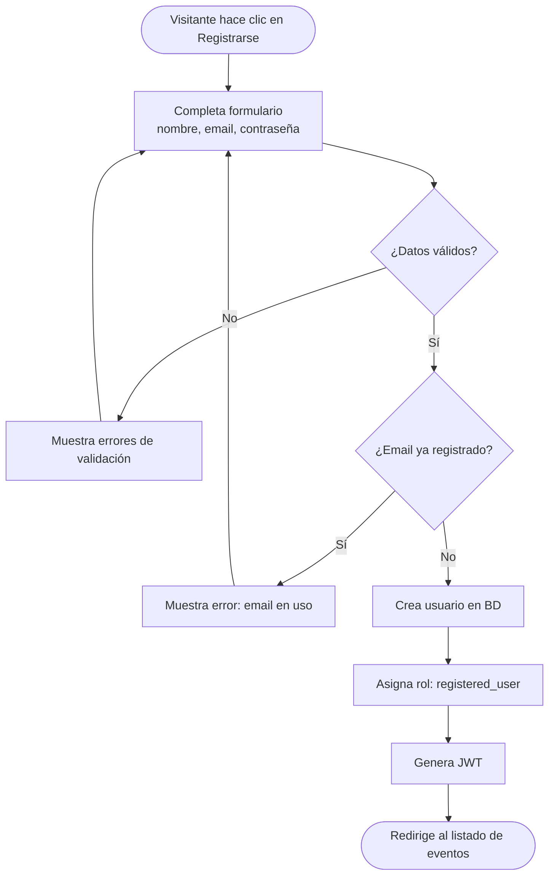
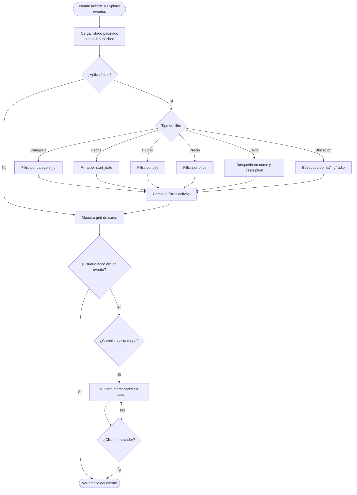
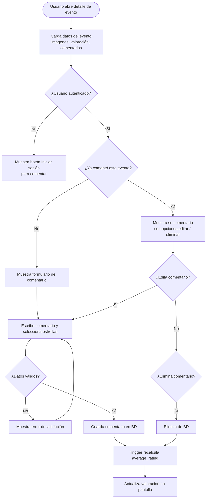
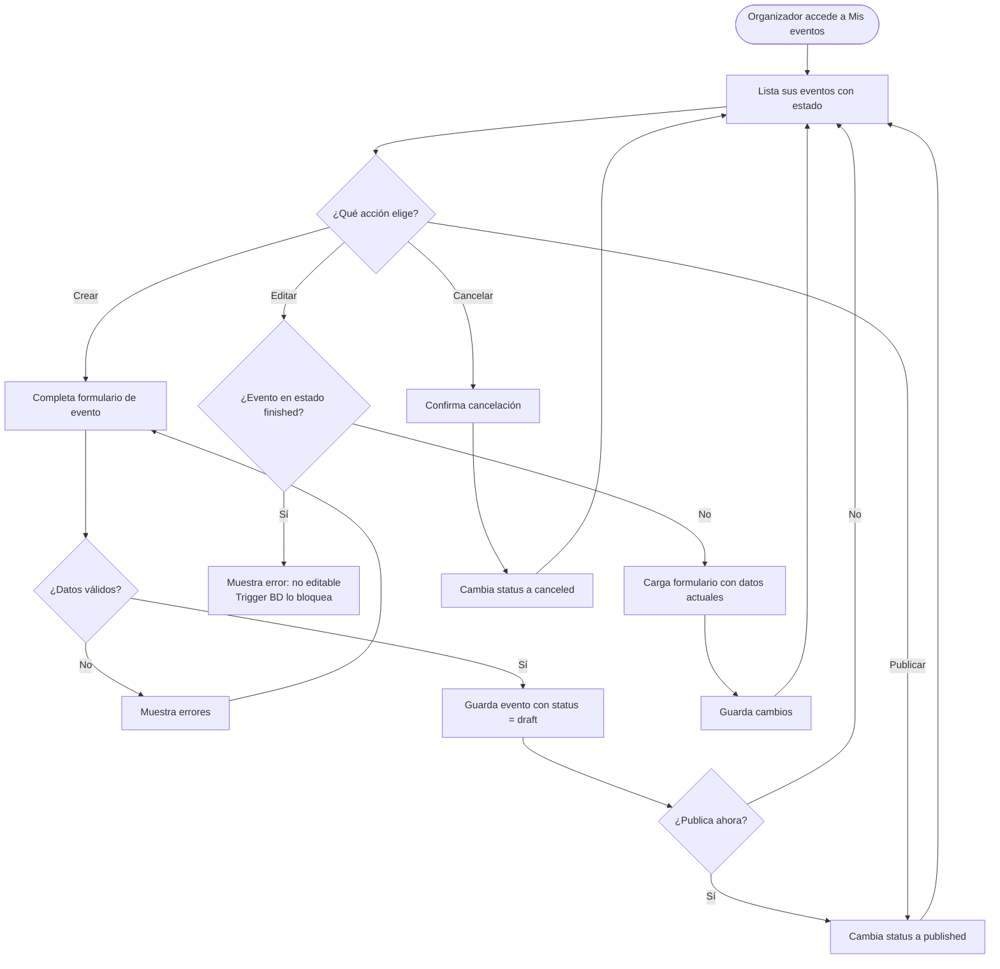
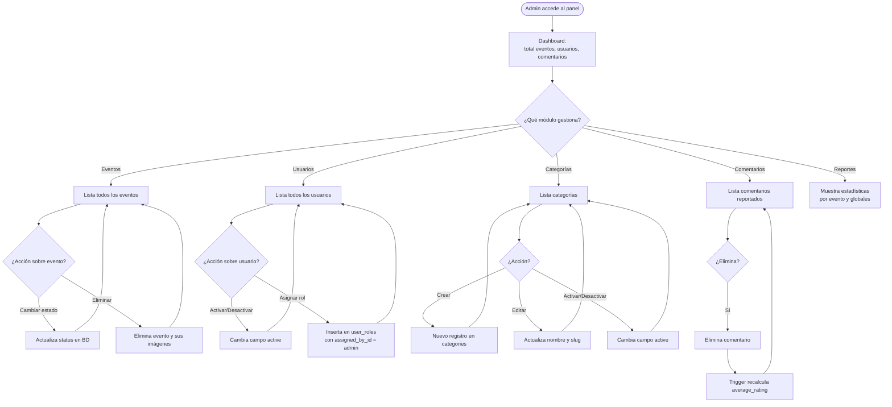

# Mapas de Procesos y Matriz de Permisos - SGE

Este documento contiene los diagramas de procesos de negocio en Mermaid y la matriz detallada de permisos por rol para el **Sistema de Gestión de Eventos (SGE)**.

---

## 1. Mapas de Procesos (Mermaid)

### Proceso 1 — Autenticación y Acceso

---

### Proceso 2 — Registro de Usuario

---

### Proceso 3 — Exploración y Búsqueda de Eventos

---

### Proceso 4 — Ver Detalle y Comentar Evento

---

### Proceso 5 — Gestión de Eventos (Organizador)

---

### Proceso 6 — Panel de Administración

---

## 2. Matriz de Permisos por Rol

**Convención:** ✓ acceso completo · ◐ acceso parcial · ✗ sin acceso

### Módulo 1 — Eventos públicos
*Listado, búsqueda, filtros, mapa, detalle*

| Acción | Visitante | Usuario registrado | Organizador | Admin |
|---|---|---|---|---|
| Ver listado de eventos | ✓ | ✓ | ✓ | ✓ |
| Buscar y filtrar eventos | ✓ | ✓ | ✓ | ✓ |
| Ver mapa de eventos | ✓ | ✓ | ✓ | ✓ |
| Ver detalle de evento | ✓ | ✓ | ✓ | ✓ |
| Ver galería de imágenes | ✓ | ✓ | ✓ | ✓ |

### Módulo 2 — Comentarios y valoraciones
*Opiniones y estrellas por evento*

| Acción | Visitante | Usuario registrado | Organizador | Admin |
|---|---|---|---|---|
| Ver comentarios | ✓ | ✓ | ✓ | ✓ |
| Publicar comentario | ✗ | ✓ | ✓ | ✓ |
| Editar su comentario | ✗ | ✓ | ✓ | ✓ |
| Eliminar su comentario | ✗ | ✓ | ✓ | ✓ |
| Eliminar cualquier comentario | ✗ | ✗ | ✗ | ✓ |

### Módulo 3 — Gestión de mis eventos
*Panel del organizador*

| Acción | Visitante | Usuario registrado | Organizador | Admin |
|---|---|---|---|---|
| Ver panel "mis eventos" | ✗ | ✗ | ✓ | ✓ |
| Crear evento | ✗ | ✗ | ✓ | ✓ |
| Editar su evento | ✗ | ✗ | ✓ | ✓ |
| Publicar su evento | ✗ | ✗ | ✓ | ✓ |
| Cancelar su evento | ✗ | ✗ | ✓ | ✓ |
| Subir imágenes | ✗ | ✗ | ✓ | ✓ |
| Editar evento ajeno | ✗ | ✗ | ✗ | ✓ |
| Eliminar evento ajeno | ✗ | ✗ | ✗ | ✓ |

### Módulo 4 — Categorías
*Catálogo de tipos de evento*

| Acción | Visitante | Usuario registrado | Organizador | Admin |
|---|---|---|---|---|
| Ver categorías | ✓ | ✓ | ✓ | ✓ |
| Crear categoría | ✗ | ✗ | ✗ | ✓ |
| Editar categoría | ✗ | ✗ | ✗ | ✓ |
| Activar / desactivar | ✗ | ✗ | ✗ | ✓ |

### Módulo 5 — Usuarios y roles
*Gestión de cuentas*

| Acción | Visitante | Usuario registrado | Organizador | Admin |
|---|---|---|---|---|
| Registrarse | ✓ | ✗ | ✗ | ✗ |
| Iniciar sesión | ✓ | ✓ | ✓ | ✓ |
| Ver su perfil | ✗ | ✓ | ✓ | ✓ |
| Editar su perfil | ✗ | ✓ | ✓ | ✓ |
| Ver todos los usuarios | ✗ | ✗ | ✗ | ✓ |
| Activar / desactivar usuario | ✗ | ✗ | ✗ | ✓ |
| Asignar roles | ✗ | ✗ | ✗ | ✓ |

### Módulo 6 — Panel de administración
*Dashboard y moderación*

| Acción | Visitante | Usuario registrado | Organizador | Admin |
|---|---|---|---|---|
| Ver dashboard general | ✗ | ✗ | ✗ | ✓ |
| Ver todos los eventos | ✗ | ✗ | ✗ | ✓ |
| Cambiar estado de cualquier evento | ✗ | ✗ | ✗ | ✓ |
| Moderar comentarios | ✗ | ✗ | ✗ | ✓ |

### Módulo 7 — Reportes y estadísticas
*Métricas del sistema*

| Acción | Visitante | Usuario registrado | Organizador | Admin |
|---|---|---|---|---|
| Ver estadísticas de sus eventos | ✗ | ✗ | ✓ | ✓ |
| Ver estadísticas globales | ✗ | ✗ | ✗ | ✓ |

---

## 3. Navegación y Menú Dinámico

* **Visitante**:
  `Inicio | Explorar eventos | Mapa | [Iniciar sesión] [Registrarse]`
* **Usuario registrado**:
  `Inicio | Explorar eventos | Mapa | Mi perfil | Mis comentarios | [Cerrar sesión]`
* **Organizador**:
  `Inicio | Explorar eventos | Mapa | Mis eventos | Mi perfil | [Cerrar sesión]`
* **Administrador**:
  `Inicio | Explorar eventos | Panel admin (Dashboard | Eventos | Usuarios | Categorías | Reportes) | [Cerrar sesión]`
